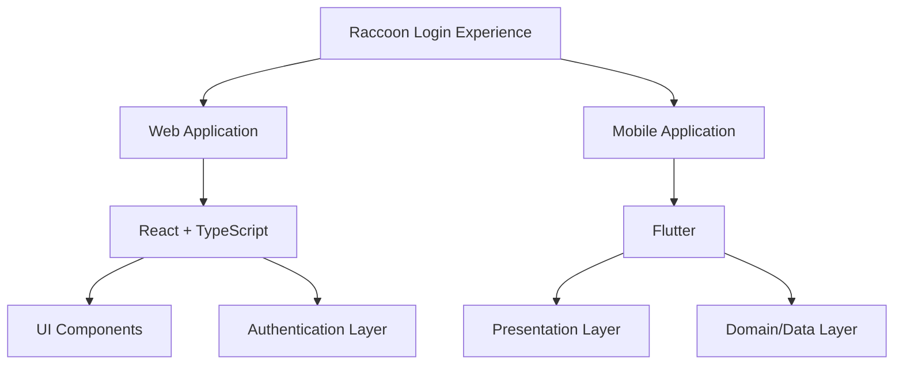

<div align="center">

<h1>

Raccoon Login Experience
</h1>

<p>
Interactive Cross-Platform Login Experience
</p>

</div>

<h1></h1>

A modern authentication experience built with **React + TypeScript** and **Flutter**.

This project demonstrates how a traditional login screen can become a more engaging product experience through micro-interactions, animations, and a reactive mascot.

Designed as a reusable developer-friendly implementation for modern applications.


<br>

<div align="center">


<br><br>


<br><br>


<a href="https://parsashafizade.github.io/raccoon-login-experience/" target="_blank">
  
</a>

</div>


---

## Demo

Watch the interactive login experience:

[]()

---
## Architecture

The project contains two independent implementations sharing the same product concept.



---

## Tech Stack

### Web

- React
- TypeScript
- Vite
- CSS Modules

### Mobile

- Flutter
- Dart
- Feature-based architecture

---

<br>

<div align="center">


## </div>

## Getting Started

### Web

```bash
cd web

npm install

npm run dev
```

---

### Mobile

```bash
cd mobile

flutter pub get

flutter run
```
---

## Contributing

Contributions are welcome.

You can contribute by:

- Reporting bugs
- Suggesting improvements
- Submitting pull requests
---

## Future Improvements

- Real authentication backend integration
- Additional mascot interaction states
- More themes and customization options
- Production-ready authentication services

---

## License

This project is licensed under the MIT License.

You are free to use, modify, and distribute this project while keeping the original license notice.

---

## Author

**Parsa Shafizade**

GitHub: https://github.com/parsashafizade

---

<a href="https://parsashafizade.github.io/raccoon-login-experience/" target="_blank">
  
</a>

