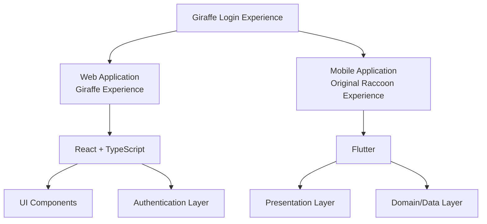

<div align="center">

<h1>

Giraffe Login Experience
</h1>

<p>
Interactive Cross-Platform Login Experience
</p>

</div>

<h1></h1>

A modern authentication experience built with **React + TypeScript** and **Flutter** — a fork of [Raccoon Login Experience](https://github.com/parsashafizade/raccoon-login-experience) by Parsa Shafizade.

This project demonstrates how a traditional login screen can become a more engaging product experience through micro-interactions, animations, and a reactive mascot — in this case, a very tall one.

Designed as a reusable developer-friendly implementation for modern applications.


<br>

<div align="center">


<br><br>


<a href="https://sedwna.github.io/giraffe-login-experience/" target="_blank">
  
</a>

</div>


---

## The Experience

A full-height cartoon giraffe stands **behind** the frosted-glass login card — its body softly blurred behind the glass, its neck and head rising above it.

- **Eyes that follow you** — the giraffe tracks your pointer around the screen, and while you type its eyes follow the caret across the field.
- **Privacy, please** — while a hidden password is being typed, the giraffe ducks down behind the glass, visible only as a blurred silhouette.
- **Periscope mode** — toggle password visibility on and it rises halfway back up, periscope-style, one eye open, peeking over the card edge.
- **The long walk** — above the Sign-in button, a small walking giraffe advances toward a door as the form is completed:
  - **Correct credentials** — the door opens and the giraffe ducks through.
  - **Wrong credentials** — it bumps the locked door, recoils, and shakes its head.

### Demo Account

| Username  | Password    |
| --------- | ----------- |
| `giraffe` | `Giraffe1!` |

- Signing in as `giraffe` with any wrong password demonstrates the failure journey.
- Any **other** well-formed username/password combination signs in successfully.
- A well-formed password contains a lowercase letter, an uppercase letter, a digit, and a symbol.

---

## Demo

Try the interactive login experience:

<a href="https://sedwna.github.io/giraffe-login-experience/" target="_blank">
  
</a>

---
## Architecture

The project contains two independent implementations sharing the same product concept.

> **Note:** the giraffe experience currently ships in the **web (React) app only**. The Flutter app still runs the original raccoon experience — porting the giraffe to Flutter is a future step.



---

## Tech Stack

### Web

- React
- TypeScript
- Vite
- CSS Modules

### Mobile

- Flutter
- Dart
- Feature-based architecture

---

## The Mascot

A cartoon giraffe with a soft, Pixar-ish 3D feel, drawn as vector art:

- Cream / pale-butter coat (`#F0DCB8`) with terracotta patches (`#C05230` → `#B34A28`)
- Dark reddish-brown muzzle (`#9C4A2C`)
- Huge white googly eyes with small dark-brown pupils (`#3A2317`)
- Dark-brown ossicones (`#3E2917`)
- Chunky dark lace-up boots with cream fur cuffs

---

## Getting Started

### Web

```bash
cd web

npm install

npm run dev
```

---

### Mobile

```bash
cd mobile

flutter pub get

flutter run
```
---

## Contributing

Contributions are welcome.

You can contribute by:

- Reporting bugs
- Suggesting improvements
- Submitting pull requests
---

## Future Improvements

- Port the giraffe experience to the Flutter app
- Real authentication backend integration
- Additional mascot interaction states
- More themes and customization options
- Production-ready authentication services

---

## License

This project is licensed under the MIT License.

You are free to use, modify, and distribute this project while keeping the original license notice.

---

## Credits

This project is a fork of **[Raccoon Login Experience](https://github.com/parsashafizade/raccoon-login-experience)** by **Parsa Shafizade** — the original concept, raccoon mascot, and both base implementations are his work.

- Original repository: https://github.com/parsashafizade/raccoon-login-experience
- Original live demo: https://parsashafizade.github.io/raccoon-login-experience/
- Original demo video: [](https://www.linkedin.com/posts/parsa-shafizade_%D8%AD%D9%88%D8%A7%D8%B3%D8%AA-%D8%A8%D8%A7%D8%B4%D9%87-%DB%8C%DA%A9%DB%8C-%D8%AF%D8%A7%D8%B1%D9%87-%D9%86%DA%AF%D8%A7%D9%87-%D9%85%DB%8C%DA%A9%D9%86%D9%87-%DB%8C%DA%A9-login-ugcPost-7497554269437591552-1OLi/)

---

## Author

**sedwna**

GitHub: https://github.com/sedwna

---

<a href="https://sedwna.github.io/giraffe-login-experience/" target="_blank">
  
</a>
