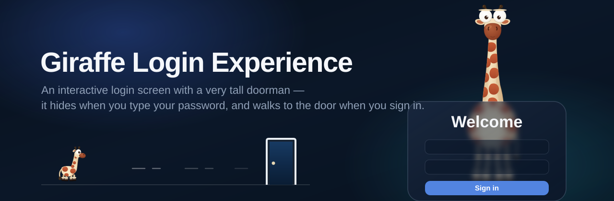
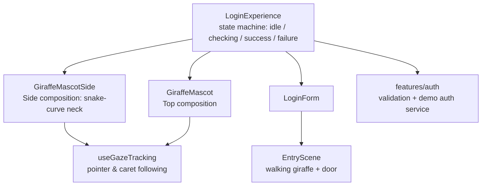
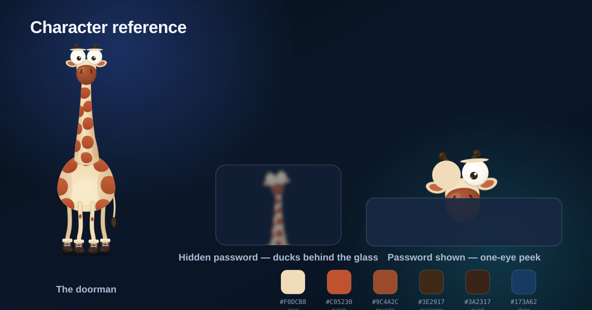

<div align="center">

<h1>

Giraffe Login Experience
</h1>

<p>
Interactive Login Experience
</p>

</div>

<h1></h1>

A modern authentication experience built with **React + TypeScript** — a fork of [Raccoon Login Experience](https://github.com/parsashafizade/raccoon-login-experience) by Parsa Shafizade.

This project demonstrates how a traditional login screen can become a more engaging product experience through micro-interactions, animations, and a reactive mascot — in this case, a very tall one.

Designed as a reusable developer-friendly implementation for modern applications.


<br>

<div align="center">



<br><br>


<br><br>


<a href="https://sedwna.github.io/giraffe-login-experience/" target="_blank">
  
</a>

</div>


---

## The Experience

The demo ships **two compositions**, switchable live from the pill at the top of the page:

- **Top** — the giraffe stands behind the frosted-glass card, its neck and head rising above it.
- **Side** — the full-height body hides behind the card while the neck sweeps out past the card's left edge in a snake-like curve, head hanging outside beside the form.

In both, the body reads through the backdrop blur as a soft silhouette.

- **Eyes that follow you** — the giraffe tracks your pointer around the screen, and while you type its eyes follow the caret across the field.
- **Privacy, please** — while a hidden password is being typed, the giraffe hides behind the glass (ducking down in Top, retracting its neck sideways in Side), visible only as a blurred silhouette.
- **Peeking** — toggle password visibility on and it sneaks halfway back out with one eye open: over the card's top edge in Top, past its side edge in Side.
- **The long walk** — above the Sign-in button, a small walking giraffe waits at the start of a path. Press **Sign in** and it walks to the door:
  - **Correct credentials** — the door opens and the giraffe ducks through.
  - **Wrong credentials** — it bumps the locked door twice, recoils, shakes its head, and strides back to its waiting spot.

### Demo Account

| Username  | Password    |
| --------- | ----------- |
| `giraffe` | `Giraffe1!` |

- Signing in as `giraffe` with any wrong password demonstrates the failure journey.
- Any **other** well-formed username/password combination signs in successfully.
- A well-formed password contains a lowercase letter, an uppercase letter, a digit, and a symbol.

---

## Demo

Try the interactive login experience:

<a href="https://sedwna.github.io/giraffe-login-experience/" target="_blank">
  
</a>

---
## Architecture

The web app is a small, layered React application. The mascot and the door
scene are pure SVG + CSS animation — no animation libraries, no raster
assets.



- `GiraffeMascot` / `GiraffeMascotSide` — the two compositions of the full-body SVG character, kept as separate components with a shared gaze hook. Pose states (`idle`, `shy`, `peek`) are driven by a `data-pose` attribute and CSS transforms; the demo switch in `App.tsx` picks the composition.
- `EntryScene` — the doorway strip above the Sign-in button; walk, bump, and enter choreographies are keyframe animations synced to the submit state machine (success 2.4s, failure 3.8s).
- `features/auth` — credential validation and a demo authentication service with an `INVALID_CREDENTIALS` path for the reserved demo username.

---

## Tech Stack

- React 19
- TypeScript
- Vite
- CSS Modules (no UI/animation libraries)

---

## The Mascot

A cartoon giraffe with a soft, Pixar-ish 3D feel, drawn as vector art:

- Cream / pale-butter coat (`#F0DCB8`) with terracotta patches (`#C05230` → `#B34A28`)
- Dark reddish-brown muzzle (`#9C4A2C`)
- Huge white googly eyes with small dark-brown pupils (`#3A2317`)
- Dark-brown ossicones (`#3E2917`)
- Chunky dark lace-up boots with cream fur cuffs

<div align="center">



</div>

---

## Getting Started

```bash
cd web

npm install

npm run dev
```

The production build (`npm run build`) is deployed to GitHub Pages by the
`Deploy Web Demo` workflow on every push to `main` that touches `web/`.

---

## Contributing

Contributions are welcome.

You can contribute by:

- Reporting bugs
- Suggesting improvements
- Submitting pull requests
---

## Future Improvements

- Real authentication backend integration
- Additional mascot interaction states
- More themes and customization options

---

## License

This project is licensed under the MIT License.

You are free to use, modify, and distribute this project while keeping the original license notice.

---

## Credits

This project is a fork of **[Raccoon Login Experience](https://github.com/parsashafizade/raccoon-login-experience)** by **Parsa Shafizade** — the original concept, raccoon mascot, and base implementation are his work. The `mobile/` folder contains his original Flutter implementation, kept untouched from upstream; everything giraffe lives in `web/`.

- Original repository: https://github.com/parsashafizade/raccoon-login-experience
- Original live demo: https://parsashafizade.github.io/raccoon-login-experience/
- Original demo video: [](https://www.linkedin.com/posts/parsa-shafizade_%D8%AD%D9%88%D8%A7%D8%B3%D8%AA-%D8%A8%D8%A7%D8%B4%D9%87-%DB%8C%DA%A9%DB%8C-%D8%AF%D8%A7%D8%B1%D9%87-%D9%86%DA%AF%D8%A7%D9%87-%D9%85%DB%8C%DA%A9%D9%86%D9%87-%DB%8C%DA%A9-login-ugcPost-7497554269437591552-1OLi/)

---

## Author

**sedwna**

GitHub: https://github.com/sedwna

---

<a href="https://sedwna.github.io/giraffe-login-experience/" target="_blank">
  
</a>
